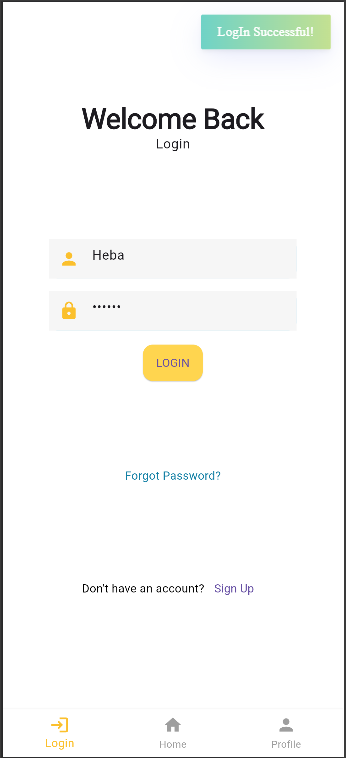
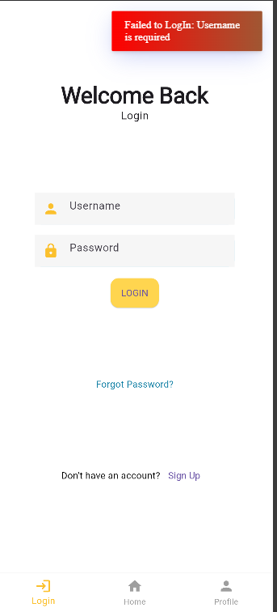
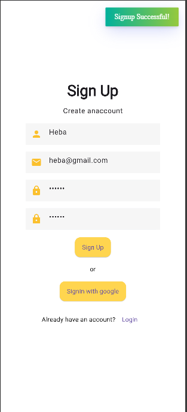
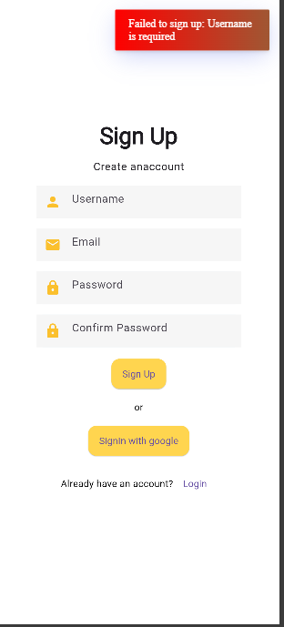
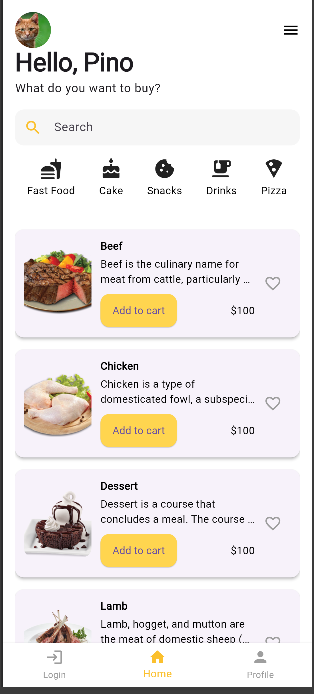
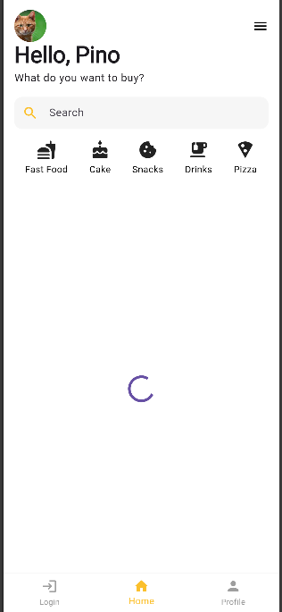

# Basic Flutter App

A clean Flutter project that demonstrates a modern login and sign-up UI, along with a dynamic home screen that fetches a list of food categories from a public API.

## ✨ Features

* Login screen with validation and SnackBar/Toast feedback
* Sign-up screen with matching clean UI
* TextFormField inputs wrapped in a reusable widget (`AppTextField`)
* **Consistent app-wide theming** using `ThemeData` and a centralized `AppTheme`
* Color palette extracted into `AppColors` for easy reuse
* Home screen that fetches and displays food categories from the network
* Bottom navigation bar to switch between Home, Login, and **Profile**
* **Profile screen** added and is currently under development
* **Bloc state management** implemented for Login and Signup workflows
* **Firebase integration** for authentication (login & signup)

## 🧠 State Management

This app uses the **Bloc (Business Logic Component)** pattern for state management:

* Handles form validation and UI state changes efficiently
* Bloc logic is separated for Login and Signup (`login_bloc`, `signup_bloc`)
* Emits loading, success, and failure states for better user feedback and flow control

## 🔥 Firebase

The project integrates **Firebase** for:

* User authentication (login/signup)
* Real-time validation and backend communication

Firebase is initialized using the `firebase_core` package and configured with `firebase_options.dart` generated by FlutterFire CLI.

## 🎨 Theming

The app applies global theming using `ThemeData` inside `MaterialApp`, customizing:

* AppBar color
* Input decoration themes
* Text styles via `TextTheme`
* Button styling

You can control these globally from `utils/app_themes.dart` and reuse shared colors from `utils/app_colors.dart`.

## 🌐 API Integration

The home screen uses a real API — [TheMealDB](https://www.themealdb.com/api.php) — to fetch and display food categories.
Each list item includes:

* A thumbnail image
* Category title
* A brief description

> 💡 This is like a past project I did using dummy json API that I previously worked with in a JavaScript project. This time, I integrated it using Dart and the `http` package in Flutter.

## 📸 Screenshots

### 🔐 Login Screen




### 📝 Sign Up Screen




### 🏠 Home Screen




## 🚀 Getting Started

To run this project on your machine:

1. **Clone the repository:**

   ```sh
   git clone https://github.com/Hebabo/Login_Signup.git
   cd Login_Signup
   ```

2. **Install dependencies:**

   ```sh
   flutter pub get
   ```

3. **Run the app:**

   ```sh
   flutter run
   ```

## 📦 Dependencies Used

| Package                                                   | Purpose                                |
| --------------------------------------------------------- | -------------------------------------- |
| [`http`](https://pub.dev/packages/http)                   | For making API requests                |
| [`flutter_bloc`](https://pub.dev/packages/flutter_bloc)   | Bloc state management                  |
| [`fluttertoast`](https://pub.dev/packages/fluttertoast)   | Displaying toast messages for feedback |
| [`firebase_core`](https://pub.dev/packages/firebase_core) | Firebase initialization                |
| [`firebase_auth`](https://pub.dev/packages/firebase_auth) | Firebase authentication                |

## 🛠️ Folder Structure

```
lib/
├── main.dart
├── auth/
│   ├── login/
│   │   ├── bloc/
│   │   │   ├── login_bloc.dart
│   │   │   ├── login_event.dart
│   │   │   ├── login_state.dart
│   │   ├── models/
│   │   │   ├── auth_repo.dart
│   ├── signup/
│   │   ├── bloc/
│   │   │   ├── signup_bloc.dart
│   │   │   ├── signup_event.dart
│   │   │   ├── signup_state.dart
│   │   ├── models/
│   │   │   ├── auth_repo.dart
│   ├── bloc_screens/
├── utils/
│   ├── app_colors.dart
│   ├── app_themes.dart
│   ├── my_flutter_app_icons.dart
│   ├── login_form_validator.dart
│   ├── signup_form_validator.dart
├── views/
│   ├── profile_screen.dart   # under development
│   ├── login_screen.dart
│   ├── signin_screen.dart
│   ├── home_screen.dart
│   └── main_navigation.dart
├── widgets/
│   ├── app_text_form_field.dart
```

## 📚 Resources

* [Flutter Documentation](https://docs.flutter.dev/)
* [Lab: Write your first Flutter app](https://docs.flutter.dev/get-started/codelab)
* [Cookbook: Useful Flutter samples](https://docs.flutter.dev/cookbook)
* [Firebase for Flutter](https://firebase.flutter.dev/)

## 🔓 License

This project is for educational purposes and does not include a license.
Feel free to use and modify for your own learning.

---

Would you also like me to add a **"Firebase Setup Steps"** section to this README so anyone cloning your project can configure it easily? (e.g., adding `google-services.json` and `firebase_options.dart`)
